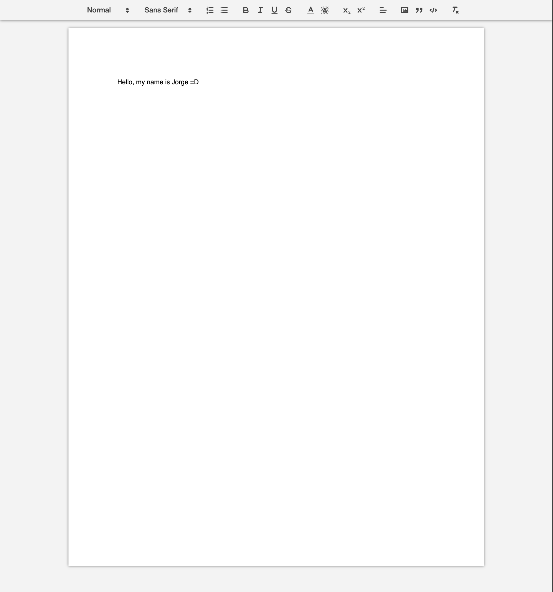

<p align="center">
  <a href="#-technologies">Technologies</a>&nbsp;&nbsp;&nbsp;|&nbsp;&nbsp;&nbsp;
  <a href="#-layout">Getting started</a>&nbsp;&nbsp;&nbsp;|&nbsp;&nbsp;&nbsp;
  <a href="#-project">Project</a>&nbsp;&nbsp;&nbsp;|&nbsp;&nbsp;&nbsp;
  <a href="#-layout">Layout</a>&nbsp;&nbsp;&nbsp;|&nbsp;&nbsp;&nbsp;
  <a href="#-license">License</a>
</p>

<p align="center">
  
  
  

  
</p>

<br>

<p align="center">
  
</p>

## 👨🏻‍💻 Status

In Progress

## 🧪 Technologies

This project was developed using the following technologies:

- [React](https://reactjs.org)
- [Quill](https://quilljs.com/docs/quickstart)
- [uuid](https://www.npmjs.com/package/uuid)
- [Socket.io](https://socket.io/)
- [Mongoose](https://mongoosejs.com/docs/connections.html)
- [React Router](https://reactrouter.com/)

## 🚀 Getting started

Clone the project and access the folder

```bash
$ git clone https://github.com/JorgeFPeres/Google-Docs-Clone && cd Google-Docs-Clone/server
```

Follow the steps below

```bash
# Install the dependencies
$ npm install

# Start the project
$ npm run devStart
```

```bash
$ git clone https://github.com/JorgeFPeres/Google-Docs-Clone && cd Google-Docs-Clone/client
```

Follow the steps below

```bash
# Install the dependencies
$ npm install

# Start the project
$ npm start
```

## 💻 Project

This is a project developed by me, using amazing tools like Quill, and making a copy of googleDocs, where you can edit the document simultaneously em two places.
Learn how to use Socke.io and uuid

## 📝 License

This project is licensed under the MIT License. See the [LICENSE](LICENSE.md) file for details.

---

<p align="center">Made with ❤️ by Jorge F Peres</p>
